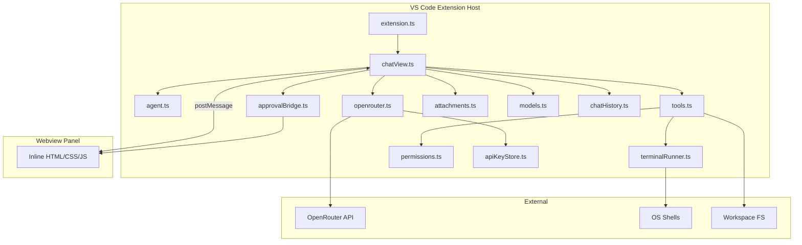
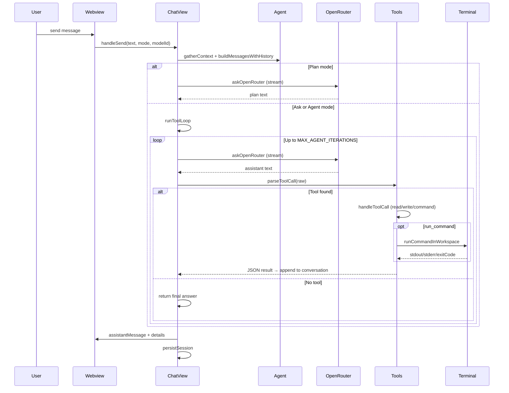

# OpenRouter Agent — AI Maintainer Guide

This document describes **OpenRouter Agent** (`openrouter-agent`) in enough detail that an AI agent (or human contributor) can read it, understand the architecture, and safely modify the codebase.

**Extension id:** `ZihadHosan.openrouter-agent`  
**Publisher:** `ZihadHosan`  
**Entry point:** `src/extension.ts` → compiled to `dist/extension.js`  
**Current version:** see `package.json` (`version` field)

---

## 1. What this project is

OpenRouter Agent is a **VS Code / Cursor extension** that provides an AI chat panel powered by the [OpenRouter](https://openrouter.ai/) API. Users bring their own API key.

It supports three interaction modes:

| Mode | Purpose | Tools | Writes files | Runs terminal |
|------|---------|-------|--------------|---------------|
| **Ask** | Q&A, explain code, read workspace | Read-only (`list_files`, `read_file`, `read_glob`) | No | No |
| **Plan** | Design before coding | None | No | No |
| **Agent** | Multi-step coding with approval | All tools | Yes (with approval) | Yes (with approval) |

The chat UI opens in a **WebviewPanel on the right** of the editor (not a sidebar view). Users can attach images, PDFs, and text/code files; pick models or use **Auto** model selection; and manage chat history across sessions.

---

## 2. Tech stack

| Layer | Technology |
|-------|------------|
| Language | TypeScript 5.x (strict mode) |
| Runtime | Node.js 18+ (extension host) |
| Editor API | VS Code Extension API (`@types/vscode` ^1.85) |
| Build | `tsc` → `dist/` |
| Markdown rendering | `marked` (bundled in `media/marked.min.js` for webview) |
| LLM provider | OpenRouter REST API (`https://openrouter.ai/api/v1/chat/completions`) |
| Packaging | `@vscode/vsce` → `.vsix` |
| Version bump | `scripts/bump-version-on-change.mjs` (runs on `npm run compile`) |

**No React, no webpack** — the chat UI is a single HTML string with inline CSS/JS generated in `chatView.ts`.

---

## 3. Project layout

```
openrouter-agent/
├── src/                    # All extension logic (TypeScript)
│   ├── extension.ts        # Activation, commands, status bar
│   ├── chatView.ts         # Webview UI + message/agent loop (largest file)
│   ├── agent.ts            # System prompts, context gathering, message building
│   ├── openrouter.ts       # OpenRouter API client (streaming + non-streaming)
│   ├── openrouterBalance.ts # Account/key credit balance for composer badge
│   ├── tools.ts            # Tool parsing, execution, file ops, tool loop helpers
│   ├── terminalRunner.ts   # Cross-platform shell execution with fallbacks
│   ├── permissions.ts      # Agent permission modes + auto-approve logic
│   ├── approvalBridge.ts   # Webview ↔ extension approval card bridge
│   ├── attachments.ts      # File/image/PDF attachment handling
│   ├── autoModel.ts        # Auto model scoring/selection
│   ├── models.ts           # Model list store (settings + custom)
│   ├── chatHistory.ts      # Session persistence
│   └── apiKeyStore.ts      # Secure API key in VS Code Secret Storage
├── media/                  # Icons, marked.min.js
├── scripts/                # Version bump script
├── docs/                   # DEVELOPMENT.md, RELEASE.md
├── dist/                   # Compiled JS (generated, not committed)
├── package.json            # Extension manifest + settings schema
├── tsconfig.json           # rootDir: src, outDir: dist
├── agents.md               # This file
├── README.md               # User-facing docs
├── CHANGELOG.md
└── PRIVACY.md
```

---

## 4. Architecture overview



---

## 5. Activation and commands

**File:** `src/extension.ts`

On `activate()`:

1. Creates singleton stores: `ModelStore`, `ApiKeyStore`, `AttachmentStore`, `ChatHistoryStore`
2. Creates `ChatViewProvider` (chat panel controller)
3. Migrates legacy API key from settings → Secret Storage
4. Shows status bar item **OpenRouter** (click → open chat)
5. Registers commands (see `package.json` → `contributes.commands`)

| Command id | What it does |
|------------|--------------|
| `openrouterAgent.openChat` | Focus/open chat panel (`Ctrl+Alt+L`) |
| `openrouterAgent.setApiKey` | Prompt for API key |
| `openrouterAgent.clearApiKey` | Remove stored key |
| `openrouterAgent.setPermissions` | Quick pick permission mode |
| `openrouterAgent.askCurrentFile` | Open chat, send Ask prompt with active file |
| `openrouterAgent.explainSelection` | Explain selected code in Ask mode |
| `openrouterAgent.fixSelection` | One-shot fix via API, apply to selection |

---

## 6. Chat UI (`chatView.ts`)

This is the **central orchestrator** (~3600 lines). Responsibilities:

- Create/manage `WebviewPanel` on the right (`ChatViewProvider.panelType`)
- Generate HTML/CSS/JS for the chat interface (`getHtml()`)
- Handle `webview.onDidReceiveMessage` → `handleWebviewMessage()`
- Send state to webview via `post({ type: ... })`
- Run the **agent tool loop** (`runToolLoop()`)
- Stream assistant tokens (`callOpenRouterStreaming()`)
- Persist sessions via `ChatHistoryStore`

### 6.1 Webview → Extension messages (inbound)

| type | Action |
|------|--------|
| `ready` | Initial sync (history, models, attachments) |
| `send` | User sends message (`text`, `mode`, `modelId`) |
| `stop` | Abort in-flight OpenRouter request |
| `clear` | Clear current session messages |
| `newSession` | Create new chat session |
| `deleteSession` | Delete session by id |
| `switchSession` | Switch active session |
| `setMode` | Ask / Plan / Agent |
| `setModel` | Select model or Auto |
| `setAutoPoolModel` | Toggle model on/off for Auto pool |
| `pickAttachments` / `addAttachments` / `removeAttachment` | Attachment UI |
| `toolApprovalResponse` | User approves/skips write or command |
| `openLink` | Open URL in external browser |

### 6.2 Extension → Webview messages (outbound)

| type | Purpose |
|------|---------|
| `init` | Full state on load |
| `userMessage` / `assistantMessage` | Chat bubbles |
| `assistantStreamStart` / `assistantPartial` / `assistantStreamCancel` | Streaming |
| `loading` | Progress steps (Step N: …) |
| `toolApproval` | Approval card for write/command |
| `terminalRunStart` / `terminalRunUpdate` / `terminalRunEnd` | Live terminal output |
| `sessions` | Session list for dropdown |
| `models` / `modelAdded` / `modelRemoved` | Model dropdown state |
| `attachmentsUpdated` | Pending attachment previews |
| `error` | Error toast in UI |

### 6.3 Key constants

```typescript
MAX_AGENT_ITERATIONS = 16   // Max tool loop rounds per user message
MAX_PARSE_RETRIES = 2       // Retries when model tool JSON is unparseable
MAX_UNVERIFIED_RETRIES = 2  // Retries when model guesses about files without tools
STOPPED_MESSAGE = '_Stopped._'
```

---

## 7. Message flow (one user send)



### 7.1 `handleSend()` steps (simplified)

1. Validate workspace (Ask/Agent need open folder)
2. Vision model checks for image/PDF attachments
3. Commit pending attachments to session storage
4. Push user message to history, persist
5. Build API conversation: system prompt + history + current user (with attachments)
6. **Plan:** single OpenRouter call, strip accidental tool markup
7. **Ask/Agent:** `runToolLoop()` with `allowWrites = (mode === 'agent')`
8. Push assistant message, persist, update webview

---

## 8. Agent prompts and context (`agent.ts`)

### 8.1 System prompts

Three system prompts define behavior:

- `ASK_SYSTEM` — read-only tools, strict “don’t guess about files” rules
- `PLAN_SYSTEM` — no tools, step-by-step plans only
- `AGENT_SYSTEM` — full tool set including `propose_write_file` and `run_command`

All include `MARKDOWN_FORMAT` rules (no wrapping entire reply in code fences).

When attachments exist, `ATTACHMENT_SYSTEM` is appended: model must analyze inline attachment content directly.

### 8.2 Workspace context

`gatherContext()` collects:

- Workspace name and root path
- Active file path
- Selected text OR truncated active file content (max 12,000 chars)

`buildPrompt()` / `buildMessagesWithHistory()` assemble OpenRouter `ChatMessage[]`.

### 8.3 Multimodal user messages

`buildUserMessageContent()` (in `attachments.ts`) builds `ContentPart[]`:

- Text parts for user message + context + inline attachment text
- `image_url` parts for images (base64 data URLs)
- `file` parts for PDFs (OpenRouter file API format)

---

## 9. OpenRouter API client (`openrouter.ts`)

### 9.1 Main function

```typescript
askOpenRouter(messages, {
  modelStore?,
  apiKeyStore,      // required
  mode?,            // ask | plan | agent — used for Auto pick
  hasVisionAttachments?,
  signal?,          // AbortSignal for Stop button
  stream?,          // default from setting streamResponses
  onChunk?,         // streaming callback
})
```

### 9.2 Model selection in request body

- If user selected a specific model → `{ model, messages }`
- If **Auto** (`__auto__`) → `pickAutoModelForRequest()` picks one model from available list based on mode, message length, vision need
- Returns error strings like `**Error:**`, `**API Error:**`, `**Network Error:**` (not thrown)
- `formatApiError()` reads `error.metadata.raw` and `provider_name` when OpenRouter returns a generic “Provider returned error”; appends situational **What you can try** bullets. Auto mode retries on provider errors via `askOpenRouterWithFallback`.

### 9.3 Streaming

- POST with `stream: true`
- Parses SSE `data:` lines
- Calls `onChunk(delta, accumulated)` per token
- Throws `AskOpenRouterAbortedError` on abort

### 9.4 Account balance (`openrouterBalance.ts`)

- `GET /api/v1/credits` → `total_credits - total_usage` when allowed for the stored API key.
- Fallback `GET /api/v1/key` → `limit_remaining` when the key has a configured limit.
- Cached 60s; `ChatViewProvider.syncAccountBalance()` posts `accountBalance` to the webview (top-right of composer). Hidden when balance cannot be fetched.

### 9.5 Headers

```typescript
Authorization: Bearer <apiKey>
HTTP-Referer: https://github.com/openrouter-agent
X-Title: OpenRouter Agent VS Code Extension
```

---

## 10. Auto model selection (`autoModel.ts`)

`pickAutoModelForRequest(availableModels, ctx)` scores each model:

| Signal | Effect |
|--------|--------|
| Vision attachments | Strongly prefer vision-capable models (`VISION` regex) |
| Ask mode | Prefer fast/free models (`FAST` regex) |
| Plan mode | Prefer reasoning models (`REASON` regex) |
| Agent mode | Prefer capable agent models (`AGENT` regex) |
| Code-related user message | Boost reasoning/agent models |
| Long conversation | Slight boost to reasoning models |

If vision attachments present but **no** vision model in list → returns `null` → UI blocks send with error.

Vision detection: `modelSupportsVision()` in `attachments.ts` (regex on model id).

**Auto pool:** Users enable any number of catalog models via toggles in the model picker (`openrouterAgent.autoPoolEnabled`). Each request scores **all** enabled ids and sends **one** to OpenRouter. With Auto off, the picker lists pool toggles at the top (toggle order) for easier management.

---

## 11. Tool system (`tools.ts`)

The LLM does **not** use native function-calling API. Instead it emits tool calls in assistant text, which the extension parses and executes locally.

### 11.1 Expected tool format (preferred)

```agent-tool
{"tool":"read_file","path":"src/extension.ts"}
```

### 11.2 Supported tools

| tool | Args | Mode | Description |
|------|------|------|-------------|
| `list_files` | `pattern`, `maxResults` | Ask, Agent | Glob file paths in workspace |
| `read_file` | `path` | Ask, Agent | Read one file (max 50k chars) |
| `read_glob` | `pattern`, `maxFiles` | Ask, Agent | List + read many files |
| `propose_write_file` | `path`, `content` | Agent only | Write/create file (with approval) |
| `run_command` | `command`, `cwd?`, `background?` | Agent only | Run shell command (with approval) |

Tool aliases are normalized (e.g. `cat` → `read_file`, `bash` → `run_command`).

Glob patterns are normalized: `*.md` → `**/*.md` (always search subfolders).

### 11.3 Tool call parsing

`parseToolCall(text)` tries multiple formats in order:

1. OpenRouter function-calls format (`<|function_call_begin|>…`)
2. ` ```agent-tool ` JSON blocks
3. OpenAI-style nested function JSON
4. XML `<tool_call>` blocks (strict + loose)

Then `resolveToolCall()` applies aliases and defaults.

### 11.4 Tool loop safeguards

- **Auto tool on turn 1:** If user message implies “read all markdown” etc., `detectUserFileIntent()` + `buildAutoToolCall()` runs before first LLM call (skipped when attachments present)
- **Unverified file claims:** If model mentions file existence without running tools, inject retry prompt or auto-run file tools
- **Parse retries:** If tool markup present but unparseable, ask model to use exact `agent-tool` format
- **Ask mode guard:** Write/command tools blocked with hint to switch to Agent

### 11.5 File path security

`resolveWorkspacePath()` ensures paths stay inside workspace root (prevents `../` escape).

### 11.6 Destructive commands

`isDestructiveCommand()` matches patterns like `rm -rf`, `git reset --hard`, `format C:`. Destructive commands **always** require approval regardless of permission mode.

---

## 12. Terminal execution (`terminalRunner.ts`)

This module runs Agent mode shell commands **inside the extension host** (not VS Code integrated terminal), with robust cross-platform shell fallback.

### 12.1 Why it exists

The extension host on Windows often has a **stripped PATH**. Commands like `npm`, `git`, `node` may not be found without PATH repair and shell fallbacks.

### 12.2 Shell resolution order

`resolveShellCandidates(command, env)` builds an ordered list:

1. User override: `openrouterAgent.shell`
2. `vscode.env.shell`
3. VS Code integrated terminal default profile path
4. **Windows:** cmd → pwsh → PowerShell 5 → Git Bash → bash → sh → WSL
5. **macOS/Linux:** `$SHELL` → `/bin/bash` → `/bin/zsh` → `/bin/sh` → …
6. User extras: `openrouterAgent.shellFallbacks`
7. Final fallback: `spawn(command, { shell: true })`

Each candidate is tried until one successfully spawns (ENOENT → try next).

### 12.3 Shell-specific spawn args

| Shell | Args |
|-------|------|
| PowerShell / pwsh | `-NoProfile -ExecutionPolicy Bypass -Command <cmd>` |
| cmd.exe | `/d /s /c <cmd>` |
| bash/sh | `-lc <cmd>` |
| wsl.exe | `bash -lc <cmd>` |

### 12.4 Background commands

`isBackgroundCommand()` auto-detects dev servers:

- `npm run dev`, `npm start`, `vite`, `ng serve`, `docker compose up`, etc.

Background behavior:

- Captures output for `BACKGROUND_INITIAL_MS` (8s), then returns `{ running: true }`
- Process continues detached (`proc.unref()`)
- Foreground commands timeout after `COMMAND_TIMEOUT_MS` (120s)

### 12.5 Result format

`formatTerminalResultForAgent()` returns JSON string with:

```json
{
  "success": true,
  "running": false,
  "command": "npm run dev",
  "cwd": "...",
  "shell": "cmd (C:\\Windows\\System32\\cmd.exe)",
  "exitCode": 0,
  "stdout": "...",
  "stderr": "...",
  "output": "...",
  "fallbacksAttempted": ["..."],
  "message": "Command completed successfully."
}
```

The LLM receives this JSON as the next `user` role message in the conversation.

### 12.6 Live UI updates

`terminalCallbacks` in `runOneTool()` posts `terminalRunStart`, `terminalRunUpdate`, `terminalRunEnd` to the webview for live output display.

---

## 13. Permissions and approvals

### 13.1 Permission modes (`permissions.ts`)

Setting: `openrouterAgent.agentPermissions`

| Mode | Auto-approve reads | Auto-approve writes | Auto-approve commands |
|------|-------------------|--------------------|-----------------------|
| `ask` | Yes | No | No |
| `readOnly` | Yes | No | No |
| `workspace` | Yes | Yes | No |
| `full` | Yes | Yes | Yes (non-destructive only) |

Session memory (cleared on reload):

- `sessionAlwaysCommands` — commands user chose “Always allow”
- `sessionAlwaysWrites` — user chose always allow writes

Destructive commands always prompt regardless of mode.

### 13.2 Approval bridge (`approvalBridge.ts`)

Webview shows inline approval card. Flow:

1. `handleToolCall()` → `confirmWriteFile()` or `confirmRunCommand()`
2. If not auto-approved → `ApprovalBridge.request()` → posts `toolApproval` to webview
3. User clicks Run / Always / Skip → `toolApprovalResponse` → `ApprovalBridge.respond()`
4. `rememberApproval()` updates session memory

---

## 14. Attachments (`attachments.ts`)

### 14.1 Supported types

| Kind | Extensions / MIME | Sent to API as |
|------|-------------------|----------------|
| `image` | png, jpeg, webp, gif | `image_url` (base64 data URL) |
| `pdf` | application/pdf | `file` part (base64) |
| `text` | .ts, .md, .json, source files, etc. | Inline text in user message |

### 14.2 Storage

- Pending attachments: in-memory per session key `_pending`
- Committed: `context.globalStorageUri/openrouterAgent/attachments/<sessionId>/`
- Not stored in settings or chat history JSON (only metadata: id, name, kind, size)

### 14.3 Limits (settings)

- `maxAttachments` (default 5)
- `maxImageSizeMb` (default 4)
- `maxPdfSizeMb` (default 10)
- Text max 120 KB per file

### 14.4 Paste screenshots

Webview listens for paste events; sends image data to extension via `addAttachments`.

---

## 15. Models (`models.ts`)

| Storage | Key | Content |
|---------|-----|---------|
| Global state | `openrouterAgent.autoPoolEnabled` | Models toggled on for Auto (chat model menu) |
| Global state | `openrouterAgent.customModels` | Legacy ids merged on first migration only |
| Global state | `openrouterAgent.selectedModelId` | Current selection or `__auto__` |

First install seeds the Auto pool from `DEFAULT_POOL_SEED_IDS` in `models.ts` (not VS Code Settings).

Special ids:

- `__auto__` — Auto selection
- `__add_model__` / `__remove_model__` — UI sentinel values

---

## 16. Chat history (`chatHistory.ts`)

Persisted in extension global state:

- `openrouterAgent.sessions` — array of `SavedChatSession` (max 50)
- `openrouterAgent.activeSessionId`

Each session stores: `id`, `title`, `mode`, `modelId`, `messages[]`, timestamps.

Messages can include `attachments` metadata and `details` (tool step log for UI expand/collapse).

---

## 17. API key storage (`apiKeyStore.ts`)

- Stored in VS Code **Secret Storage** (`context.secrets`), key `openrouterAgent.apiKey`
- Never in `settings.json`
- `migrateFromSettingsIfNeeded()` moves legacy plain-text key from old setting

---

## 18. Settings reference

All under `openrouterAgent.*` in VS Code Settings:

| Setting | Type | Default | Purpose |
|---------|------|---------|---------|
| `agentPermissions` | enum | `ask` | Tool approval level |
| `shell` | string | `""` | Primary shell override |
| `shellFallbacks` | string[] | `[]` | Extra shell paths |
| `chatFontSize` | number | `0` | Chat font px (0 = 14) |
| `streamResponses` | boolean | `true` | Token streaming |
| `showAccountBalance` | boolean | `true` | Composer OpenRouter balance badge |
| `maxAttachments` | number | `5` | Per-message attachment limit |
| `maxImageSizeMb` | number | `4` | Image size cap |
| `maxPdfSizeMb` | number | `10` | PDF size cap |

---

## 19. Build, debug, release

### 19.1 Development

```bash
npm install
npm run compile      # or npm run watch
# F5 → "Run OpenRouter Agent" in Extension Development Host
```

### 19.2 Version bumping

`scripts/bump-version-on-change.mjs` runs before compile:

- 1–3 changed `src/` files → **patch**
- 4+ files or `extension.ts` / `package.json` → **minor**
- State in `.version-state.json` (gitignored)

### 19.3 Package / publish

```bash
npm run package:vsix           # local .vsix
npm run publish:marketplace    # compile + package + vsce publish
```

See `docs/RELEASE.md` for Marketplace PAT setup.

### 19.4 `.vscodeignore`

Excludes `src/`, `scripts/`, `.cursor/`, etc. from VSIX — only `dist/` ships.

---

## 20. Common modification guide for AI agents

### Add a new tool

1. Add tool name to `known` array in `parseToolCall()` (`tools.ts`)
2. Add case in `handleToolCall()` with execution logic
3. Add case in `describeToolCall()` and `describeProcessStep()`
4. Update system prompts in `agent.ts` (`ASK_SYSTEM` / `AGENT_SYSTEM`)
5. If write/command: wire approval in `confirmWriteFile` / `confirmRunCommand` pattern
6. Test in Agent mode via F5

### Add a new setting

1. Add property under `contributes.configuration.properties` in `package.json`
2. Read via `vscode.workspace.getConfiguration('openrouterAgent').get(...)`
3. Listen with `onDidChangeConfiguration` if UI must refresh (see `chatFontSize` pattern in `extension.ts`)

### Add a new chat command

1. Register in `package.json` → `contributes.commands`
2. Register handler in `extension.ts`
3. Use `chatProvider.focus()` + `sendExternalMessage()` if sending to chat

### Change shell behavior

Edit `terminalRunner.ts`:

- `windowsShellCandidates()` / `unixShellCandidates()` — add/remove shells
- `buildEnv()` — PATH repair for extension host
- `buildSpawnArgs()` — shell-specific argument format
- `BACKGROUND_PATTERNS` — auto-background command detection

### Change model Auto selection

Edit scoring in `autoModel.ts` → `scoreModel()`.

### Change UI appearance

Edit `getHtml()` in `chatView.ts` (inline CSS + JS). Webview uses `marked.min.js` for assistant markdown rendering.

### Add webview ↔ extension message type

1. Add handler branch in `handleWebviewMessage()`
2. Add `post({ type: ... })` sender
3. Add JS handler in `getHtml()` webview script (`vscode.postMessage`)

---

## 21. Error handling patterns

| Layer | Pattern |
|-------|---------|
| OpenRouter | Returns `**Error:**` strings; caller checks prefix |
| Abort | `AskOpenRouterAbortedError` / `AbortController` |
| Tools | JSON `{ error: "..." }` returned to LLM as user message |
| Terminal | `success: false` in result JSON; fallbacks listed |
| Webview | `{ type: 'error', message }` posted to UI |
| File ops | Path validation before any FS access |

---

## 22. Security model

- API keys: Secret Storage only
- File access: workspace-scoped (`resolveWorkspacePath`)
- Writes/commands: user approval (configurable)
- Destructive commands: always prompt
- No telemetry or external analytics
- Chat + attachments stored locally in extension global storage

See `PRIVACY.md` for user-facing disclosure.

---

## 23. Git conventions

- Commit author: **Zihad Hosan** only
- Do **not** add `Co-authored-by: Cursor` or `Made-with: Cursor` trailers
- Optional hook: `.githooks/commit-msg` strips Cursor attribution
- Enable: `git config core.hooksPath .githooks`

---

## 24. Related user docs

| File | Audience |
|------|----------|
| `README.md` | End users / Marketplace |
| `docs/DEVELOPMENT.md` | Contributors (F5, clone) |
| `docs/RELEASE.md` | Release checklist |
| `CHANGELOG.md` | Version history |
| `PRIVACY.md` | Privacy policy |
| `agents.md` | AI agents / deep architecture (this file) |

---

## 25. Mental model summary

1. **User types in webview** → message goes to `ChatViewProvider`
2. **Context + history + attachments** assembled by `agent.ts` / `attachments.ts`
3. **OpenRouter** called via `openrouter.ts` (streamed tokens back to webview)
4. **Model may emit tool JSON in text** → parsed by `tools.ts`
5. **Tools run locally** (read files, write with approval, run commands via `terminalRunner.ts`)
6. **Tool results** appended to conversation → loop until final answer or max iterations
7. **Everything persisted** in `ChatHistoryStore`; API key in `ApiKeyStore`

The extension is intentionally **self-contained**: no backend server, no database — only VS Code APIs, local FS, and OpenRouter HTTP.
